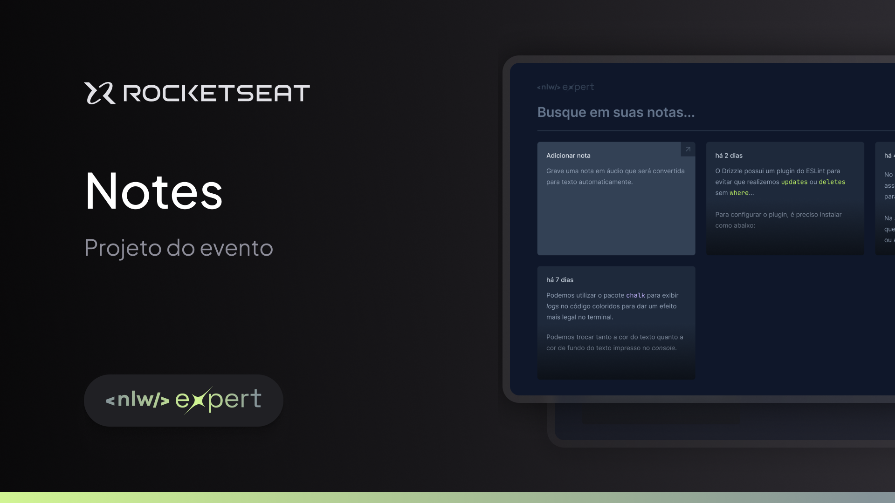

<p align='center'>
  
</p>



## 🗒️ Sobre o projeto
Aplicativo de notas desenvolvido durante a NLW Expert da Rocketseat. A aplicação tem como principal finalidade a criação de notas via texto digitado ou por gravação de áudio, que é traduzido para texto pela lib nativa do browser SpeechRecognition API ([consultar compatibilidade do browser](https://developer.mozilla.org/en-US/docs/Web/API/SpeechRecognition#browser_compatibility)). 

## 🔗 Acesse o deploy da aplicação
[](https://nlw14-expert-react-notes.vercel.app/)

## ⚙️ Funcionalidades
- Criar uma nova nota por texto digitado ou por gravação de áudio
- Apagar uma nota existente
- Listagem de notas por data de criação
- Filtragem de notas

## 🛠️ Tecnologias e ferrementas utilizadas

- [TypeScript](https://www.typescriptlang.org/)
- [React](https://reactnative.dev/)
- [Vite](https://vitejs.dev/)
- [TailwindCSS](https://tailwindcss.com/)
- [Radix UI](https://www.radix-ui.com/)
- [Shadcn/ui](https://ui.shadcn.com/)
- [Lucide React](https://lucide.dev/guide/packages/lucide-react)
- [date-fns](https://date-fns.org/)
- [Sonner](https://sonner.emilkowal.ski/)


## 💻 Instalando e rodando o projeto localmente
Para executar a aplicação em sua máquina localmente, certifique-se de ter o Node.js e um gerenciador de pacotes instalados antes de prosseguir com as etapas abaixo:


```bash
# Passo 1: Clone este repositório
$ git clone https://github.com/welisonw/nlw14-expert-react-notes.git


# Passo 2: Acessa a pasta do projeto
$ cd nlw14-expert-react-notes


# Passo 3: Instale as dependências
## pnpm 
$ pnpm install

ou

## npm
$ npm install

ou

## yarn
$ yarn install


# Passo 4: Inicie o projeto
## pnpm
pnpm run dev

ou
## npm
npm run dev

ou

## yarn
yarn run dev

# A aplicação estará disponível em http://localhost:5173.
```

## 📝 Licença
Esse projeto está sob a licença **MIT**. Veja o arquivo [LICENSE](LICENSE) para mais detalhes.
